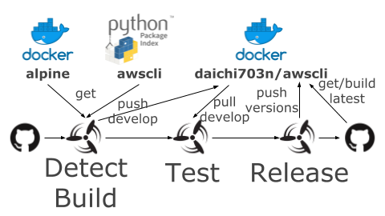

# Docker AWS CLI
Docker Image for running AWS CLI.

https://hub.docker.com/r/daichi703n/awscli

## CI

Docker Image is built by Concourse CI.  

Triggers:
- DockerHub: [alpine](https://hub.docker.com/_/alpine) new latest image (linux/amd64)
- GitHub: [aws/awscli](https://github.com/aws/aws-cli) new release (exclude dev)

(TODO) Summarized Continuous Build by [Docker Build Pipeline](https://github.com/daichi703n/docker-build-pipeline).

## versioning (WIP)

|version name |Static/Dynamic |meaning |
|:-- |:-- |:-- |
|latest |Dynamic |Latest Build (with latest awscli & alpine version) (Automated Build by Docker Hub) |
|x.x |Dynamic |AWS CLI minor version (with latest alpine version) |
|x.x.x |Dynamic |AWS CLI patch version (with latest alpine version) |
|x.x.x-alpinex.x.x |Static |AWS CLI patch version (with all alpine patch version) |

(TODO) **latest** release should be support latest minor version of **awscli** and **alpine**. patch version update (with previous minor version) is NOT tagged to latest.

ex) Docker Image Upgrade LifyCycle

|awscli |alpine |upgrade-tags |new-tags |
|:-- |:-- |:-- |:-- |
|minor |minor |latest, x.x, x.x.x |x.x.x-alpinex.x.x |
|minor |patch |latest, x.x, x.x.x |x.x.x-alpinex.x.x |
|minor |none  |latest, x.x, x.x.x |x.x.x-alpinex.x.x |
|patch |minor |latest, x.x, x.x.x |x.x.x-alpinex.x.x |
|patch |patch |latest, x.x, x.x.x |x.x.x-alpinex.x.x |
|patch |none  |latest, x.x, x.x.x |x.x.x-alpinex.x.x |
|none  |minor |latest, x.x, x.x.x |x.x.x-alpinex.x.x |
|none  |patch |latest, x.x, x.x.x |x.x.x-alpinex.x.x |
|none  |none  |none |none |

(TODO) Old-minor version patch: **latest** will not be upgraded.

#TODO: (figure)

## Bootstrap Docker Repository
1. Create Docker Repository
2. Link to GitHub Repository  
(Not Automated)

## TEST
On building new Docker Image, test container works properly.

Please check `ci/tasks/docker-test.sh`.

|Test Command |Note |
|:-- |:-- |
|aws --version | |
|aws ec2 describe-instances | |
|aws ec2 run-instances | |
|aws ec2 terminate-instances | |
|aws s3 ls | |
|aws s3 mb  | |
|aws s3 cp local s3://xxx | |
|aws s3 cp s3://xxx local | |
|aws s3 rb | |
